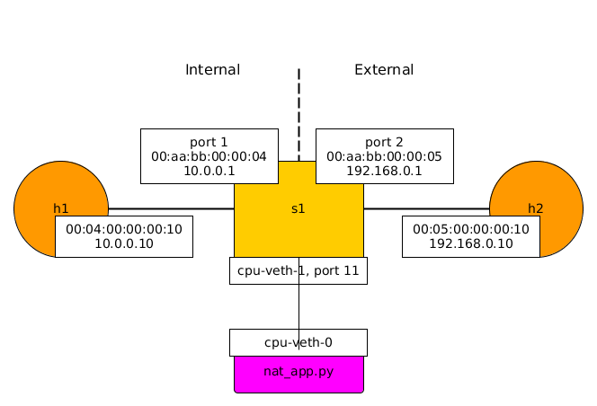

# Simple NAT

## Description

This program implements a very basic full-cone NAT for TCP traffic (over
IPv4). According to [Wikipedia]
(https://en.wikipedia.org/wiki/Network_address_translation#Methods_of_translation),
a full-cone NAT is defined as follows:

Once an internal address (iAddr:iPort) is mapped to an external address
(eAddr:ePort), any packets from iAddr:iPort are sent through eAddr:ePort. Any
external host can send packets to iAddr:iPort by sending packets to eAddr:ePort.

Note that this program was built on top of the simple_router P4 program, so you
will find some similarities.

This program was added to illustrate two things:
- how to re-compute a TCP checksum after having modified the TCP header (which
is required for a TCP NAT)
- how to write a simple app that receives and emits "CPU packets"

This program is slightly more advanced than most others in this repository, so
we recommend that you become familiar with the copy_to_cpu example before
studying this one.

The program implements very basic funtionality only. For example it supports
only one internal interface, even though we may extend this in the future. The
Mininet topology used for the demo is the following:

The program in a nutshell:
- non-TCP traffic is dropped.
- when a TCP packet is received on the external interface, for which there is no
mapping, the packet is dropped.
- when a TCP packet is received on the internal interface, for which there is no
mapping, the packet is sent to CPU and 2 new rules are added to the `nat` table
to allow translation and forwarding of TCP packets in both directions. The
packet is then re-injected in the dataplane (to avoid dropping the SYN packet).
- when a TCP packet is received on the either interface, for which there is a
mapping, the appropriate rewrites are executed for the IPv4 and TCP headers and
the packet is forwarded appropriately.

The most important part of the program is the `nat` table. If you understand
what this table is doing, the rest of the program is mostly IPv4 forwarding. You
should also take a long look at [nat_app.py] (nat_app.py), which manages the
mappings and dynamically adds rules to the `nat` table.

We use 11 as the CPU port. There is a special CPU veth pair (`cpu-veth-0` /
`cpu-veth-1`), which is use by the switch / the app to send and receive CPU
packets. The veth pair is created by `run_demo.sh` and can be destroyed with
`cleanup.sh`.

### Running the demo

To run the demo:
- start the 1-switch Mininet topo with `sudo ./run_demo.sh`.
- start the app with `sudo python nat_app.py`.
- create a TCP flow in Mininet from `h1` (internal host) to `h2` (external host)
  - `h2 iperf -s&`
  - `h1 iperf -c h2`
- you can cleanup the demo with `sudo ./cleanup.sh`
